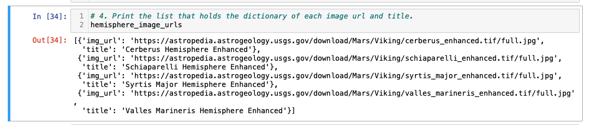
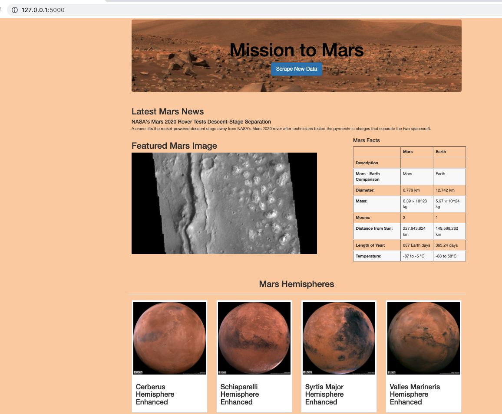
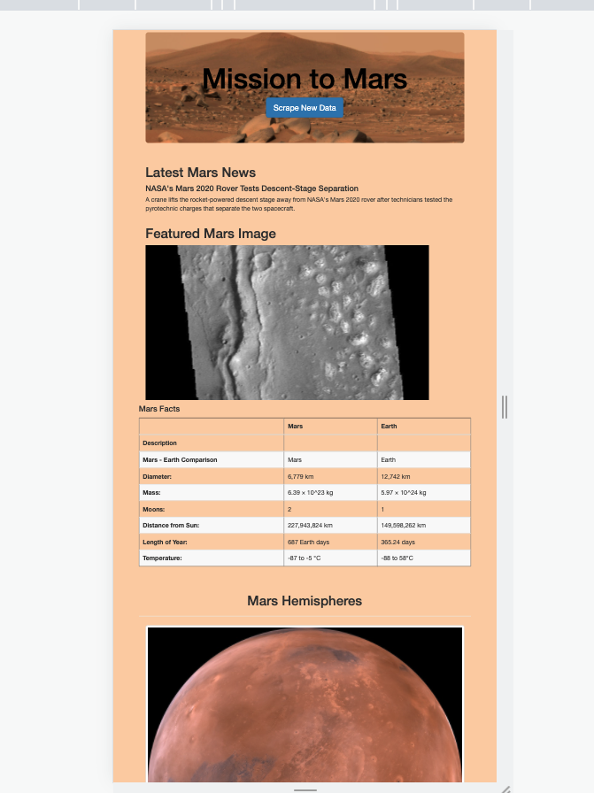
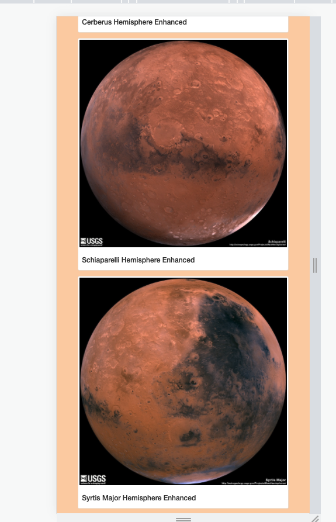

# Mission-to-Mars

## Overview of the Project 

### Purpose 

HTML Web scraping on Mars data to create Flask web application using Python and MongoDB database.

### Initial analysis 

Purpose of the initial analysis is to automate the web browser to visit different websites to extract data for Mission to Mars and store the analyzed data in MongoDB database and finally render the data in a web application created using Flask.

Web pages used to perform web scraping to gather different data related to Mars news.

[https://redplanetscience.com](https://redplanetscience.com)
[https://spaceimages-mars.com](https://spaceimages-mars.com)
[https://galaxyfacts-mars.com](https://galaxyfacts-mars.com)

The scraping method captured Mars article data which included title and summary of the recent articles, images including the links and full size images, and collection of Mars facts.

[Mission_to_Mars.ipynb](Mission_to_Mars.ipynb)  - Initial Analysis file for Mission to Mars 

### Updated Analysis

Purpose of the updated analysis is to adjust the current web app  created during initial analysis to include all four of the hemisphere images. To do this, I used BeautifulSoup and Splinter to scrape full-resolution images of Mars’s hemispheres and the titles of those images, store the scraped data on a Mongo database, use a web application to display the data, and alter the design of the web app to accommodate these images.

Web pages used to perform web scraping to gather images and titles to Mars Hemispheres.

[https://marshemispheres.com/](https://marshemispheres.com/)

The scraping method captured 4 Mars Hemisphere images, urls, and the title.

[Mission_to_Mars_Challenge.ipynb](Mission_to_Mars_Challenge.ipynb)  - Updated Analysis for Mission to Mars 

[scraping.py](scraping.py)   - Scraping file for Mission to Mars 

[index.html](index.html)   - Html file for Mission to Mars 

[app.py](app.py) - App file to create a web applciaiton for Mission to Mars 

## Summary

Web application created with Flask that included images,a table with Mars information and the latest article title,description which were scraped from NASA's web page. "Scrape New data" button would display the updated new information on website and on MongoDB eachtime clicked. 

Viewing form Mobile device 

